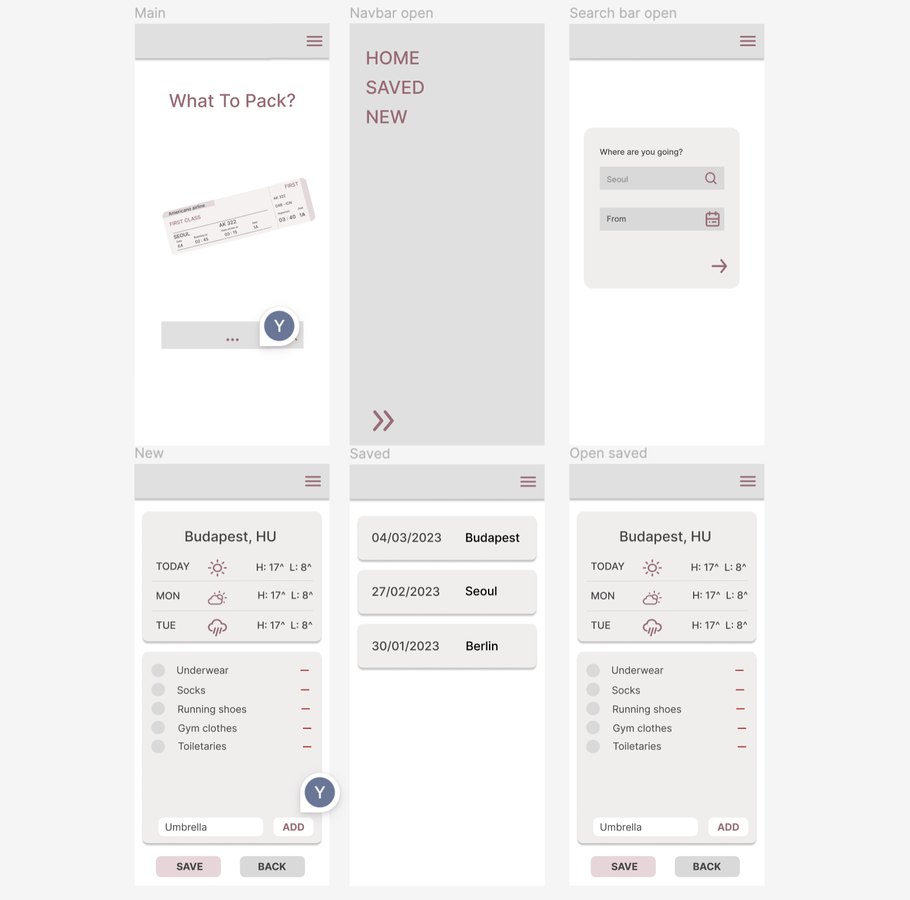

# What To Pack?!

[Click and start packing!](https://what-to-pack.netlify.app/)

Are you tired of the repetitive and tedious process of packing for different climates every two days as a flight attendant? Look no further than this all-in-one packing app, **What To Pack?!**!

Say goodbye to the hassle of opening multiple apps to check weather and take notes. **WTP** streamlines the process by combining a weather app and a note, providing you with a must-carry item list as well as some recommendations for your next destination in just one click. Save time and energy while staying organized with our cabin crew-friendly packing app.

## Table of contents

1. [What it does](#what-it-does)
2. [Why WTP was built](#why-wtp-was-built)
3. [How What To Pack?! was built](#how-what-to-pack-was-built)
4. [Challenges I faced and how I solved them](#challenges-i-faced-and-how-i-solved-them)
5. [Future features](#future-features)
6. [Development](#development)

## What it does

## Why WTP was built?

Although packing became a daily routine as cabin crew, It still feels tedious and time consuming. I have always thought that I could shorten this process. What if there was an app where a user can check the forecast of a destination, get a default item list the user saved and also suggestions for weather specific items at one go? This is why I decided to build this app, to "automate boring things".

## How WTP was built

### Development tools

1. _React Router Dom_ to define routes and handle navigation in this web app, creating a smooth SPA experience.
2. _Redux_ for centralized state management in a single store.
3. _Redux Toolkit_ to simplify working with Redux in React app and to make debugging easier.
4. _[Location API](https://rapidapi.com/wirefreethought/api/geodb-cities)_ to search destinations by name.
5. _[Weather API](https://rapidapi.com/weatherapi/api/weatherapi-com/)_ to current weather and forecast data.

### Design planning with Figma

After having an rough idea to build **WTP**, I created a initial design using Figma.

## Challenges I faced and how I solved them.

## Future features

- Auto suggestions for different climates and weather condition:

After checking the minimum and maximum temperature of the destination, **WTP** can give you some recommendations to pack. For instance, it the minimum temperature was below 0 °C, items like winter jackets, gloves and a knitted hat will be added to your clothing list.

- Customized default list:

It is surely not that it is only the cabin crew who travel often. With the addition of the feature to edit the default items and categories, any frequent travelers can customize the list as they want.

## Development

### Development

1. Run `npm install` to install project dependencies.
2. Run `npm start` to start the development server.

### Production

To build the project, run:
`npm run build`
